# LambdaSpeak 
## A Next-Generation Speech Synthesizer & PCM Sample Player for the Amstrad / Schneider CPC 
#### Author: Michael Wessel (Original Hardware Design and LambdaSpeak Firmware)
#### Contributors: Dr. Stefan Stumpferl (LambdaSpeak ROM and |RSX Driver), Bryce (LambdaSpeak 2.0 SMD PCB - future work) 
#### License: GPL 3
#### Hompage: [Author's Homepage](https://www.michael-wessel.info/)
#### Version: 1.95  

### Introduction

LambdaSpeak is a next-generation speech synthesizer and PCM sample player for the Amstrad CPC line of 8bit home computers from the 1980s (i.e, the CPC 464, CPC 664, and CPC 6128). 

LambdaSpeak is a MX4-compatible IO extension that plugs into the expansion port of the CPC.

It contains the following chips:  

LambdaSpeak is based on the Epson S1V30120 TTS (text to speech) chip. An ATmega 644P-20PU 
microcontroller clocked at 20 MHz is running the LambdaSpeak firmware, which implements a high-level intelligent interface to the CPC. The LambdaSpeak firmware / ATmega 644 is also responsible for hosting and loading the Epson firmware into the S1V30120, and for controlling the Epson speech chip via the SPI interface.  The Epson firmware is rather large; hence a microcontroller with a large (64 KB of) flash memory such as the ATmega 644 was selected. 

The Epson S1V30120 firmware implements two modes of operation: a DECtalk-compatible mode, and a simplified, native Epson mode. The latter is simpler and sometimes produces more accurate speech, whereas the former offers much more fine grained control over the speech synthesis process.  DECTalk is famous for being the "singing" speech synthesizer. 

### Features 

LambdaSpeak offers the following: 

* A high-quality speech synthesizer, based on the Epson S1V30120 speech chip. LambdaSpeak uses the [39$ "TextToSpeech click" board from MikroElektronika](https://www.mikroe.com/text-to-speech-click) as a daugher board. This board basically consists of the Epson IC, an op-amp, and an audio jack. Four modes of operation are implemented by the **LambdaSpeak firmware** (not to be confused with the Epson firmware): 

  1. **Native Epson Mode:** Native because the TTS is directly performed by the Epson IC / firmware. In this mode, a stream of ASCII characters can be sent to CPC IO port &FBEE, terminated by CR (13), and the assembled ASCII string will be spoken by LambdaSpeak. Voice, volume, and speed of the speech can be changed as well.  

  2. **Native DECtalk Mode:** The DECtalk emulation offers much more fine-grained control over different aspects of the generated speech. These aspects are specified using the standard DECtalk syntax, down to the level of phonemes if desired. In this mode, LambdaSpeak can even sing a song! Again, CPC IO port &FBEE is used. 
  
  3. **SSA-1 mode:** In this mode, LambdaSpeak emulates the **Amstrad SSA-1 Speech Synthesizer**. The SSA-1 synthesizer uses a very different speech chip, the **SPO-256 AL2 from General Instruments**. This chip offers phoneme-based speech synthesis. The emulation of the SSA-1 is achieved by translating SPO-256 AL2 phonemes into DECtalk phonemes. Whereas the SSA-1 works synchronously, i.e., a phoneme is immediately uttered as soon as it arrives at the port, this is not possible with the Epson chip. Hence, LambdaSpeak employs a phoneme buffer (of 380 characters) which is first filled with phonemes, and the buffer is flushed and spoken if no phoneme has arrived for a couple of milliseconds (the buffer flush delay time if configurable). The buffer is also flushed automatically when it overflows, and a corresponding "flush buffer" command / "control byte" also exists (see below). Hence, the SSA-1 emulation works asynchronously, and a slight delay between phoneme sending and speaking should be expected. The SSA-1 uses IO ports &FBEE and &FAEE.  Please note that it is impossible to emulate the low-quality robotic sound of the SPO-256 AL2 with a modern speech IC such as the Epson S1V30120. Hence, the SSA-1 emulation will actually produce understandable speech that sounds much better than the original, but it is not 100% authentic to the original. The emulation, due to its asychronous character, is only 90%, but good enough for most of the SSA-1 driver |RSX commands and games to work flawlessly. See below for videos of the SSA-1 mode. 
       
  4. **DK'tronics mode:** In this mode, the **DK'tronics Speech Synthesizer** is emulated. The DK'tronics synthesizer uses IO port &FBFE. It is very similar to the SSA-1, and uses the same SPO-256 AL2 speech chip from General Instruments. However, the driver software and |RSX extension are different, and a different "protocol" is implemented. Unlike for the SSA-1, a ROM version of the DK'tronics driver software exists. The DK'tronics driver software implements a less advanced text-to-phoneme speech translation algorithm than the SSA-1 driver software; the latter sounds much better, IMHO. The LambdaSpeak implementation of the DK'tronics speech synthesizer works similar to the SSA-1 emulation, i.e., a phoneme buffer and auto-flushing (and speaking) of the phoneme buffer after a configurable flush buffer time delay of inactivity is performed. Similar comments regarding the authenticity and compatibility as for the SSA-1 mode apply to the DK'tronics emulation.

* An 8bit PCM Sample Player, compatible with the **Amdrum** module / sample player. In **Amdrum mode**, 8bit PCM samples can be sent to IO port &FFxx, which are being played immediately by LambdaSpeak. This mode can only be left by power cycling LambdaSpeak. Even the LambdaSpeak reset button is ineffective in this mode, as all ATmega 644 interrupts are disabled for maximal sample playing quality. The PCM audio is produced by the ATmega 644 microcontroller.      

* Optionally, LambdaSpeak 1.95 can be equipped with an op-amp-based audio mixer, used for mixing the PCM output with the speech signal. Since the speech output produced by the "TextToSpeech click" board from MikroElektronika is **only** available through the audio jack (it is not available from the pins of this board), a short (e.g, 2") audio jumper cable can be used to route the speech audio signal from the daughter board into LambdaSpeak's op-amp over the audio input jack, where it gets mixed with the PCM signal from the ATmega, and then the combined speech and PCM sample signal is available at LambdaSpeak's audio output jack. 

* The **original SPO256-AL2 speech chip** is used in the LambdaSpeak 2.1 breadboard prototype. LambdaSpeak 2.1 adds two additional modes: a SPO256-AL2-based SSA-1 mode, and a SPO256-AL2-based DK'tronics speech synthesizer mode. These modes can be considered as re-implementations of the original DK'tronics and SSA-1 speech synthesizers. The software compatability with the original speech synthesizers is 100%, as the original speech chip is being used. Speech allophones are hence uttered immediately, syncronously, no buffering takes place. The SPO256 signal lines (LRQ and SBY) are not emulated by the ATmega firmware, but are routed directly from the speech chip onto the CPC's databus, just as in the originals.  I am currently working on a LambdaSpeak 1.98 PCB which will also be equipped with the SPO256-AL2 chip, as an extension to the LambdaSpeak 1.95 PCB available for download here. No (SMD) PCB for LambdaSpeak 2.0 and LambdaSpeak 2.1 exist yet (work in progress). 

### Media 

Current version of **LambdaSpeak 1.95** - please notice that **the voltage SMD jumper of the TextToSpeech click daughter board must be set to the 5V position (requires soldering):** 

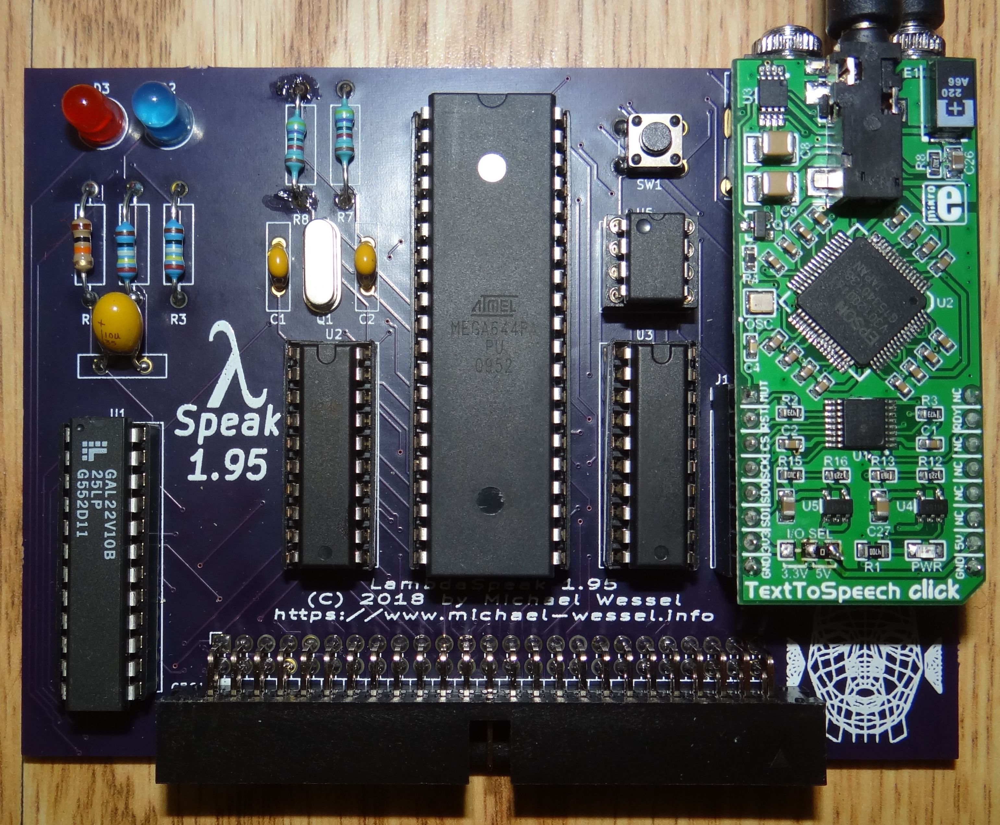

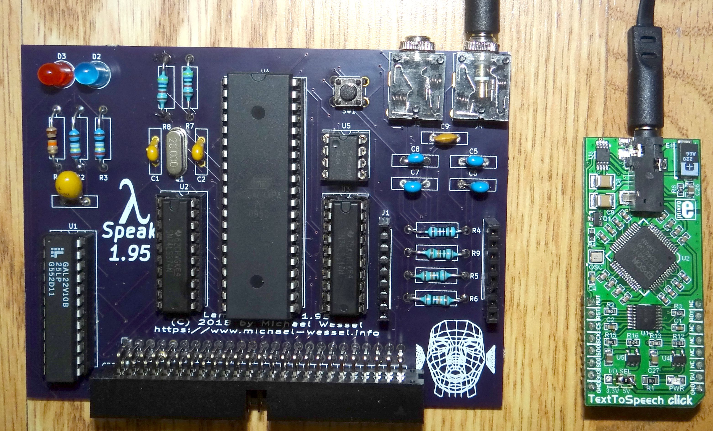

LambdaSpeak is **MX4 compatible** and can either be plugged into the Mother X4 board, a standard 50-pin ribbon cable, or my [MX4 compatible CPC 464 expansion port adapter for the CPC 464](https://oshpark.com/shared_projects/3yA33GYO) can be used:  

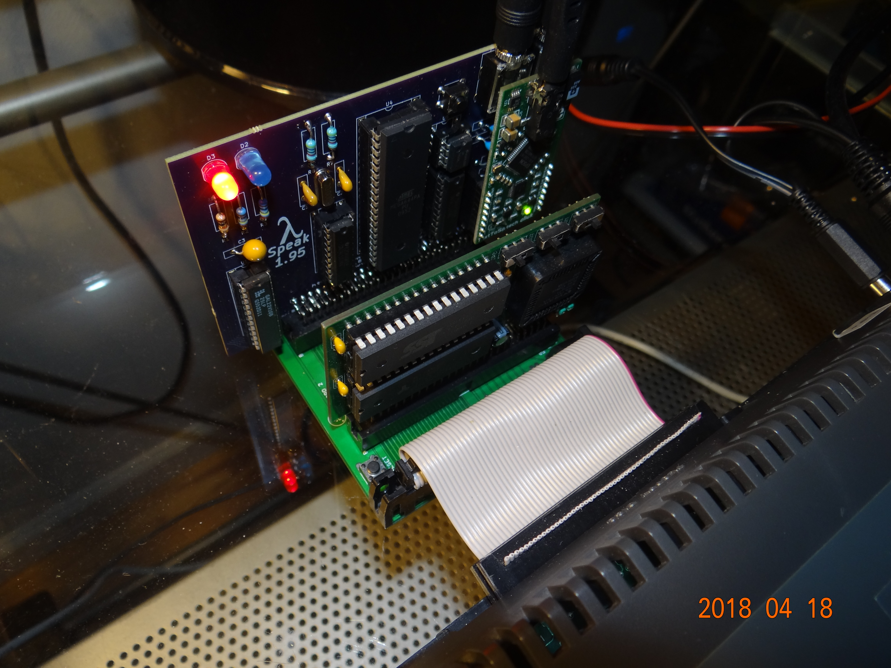

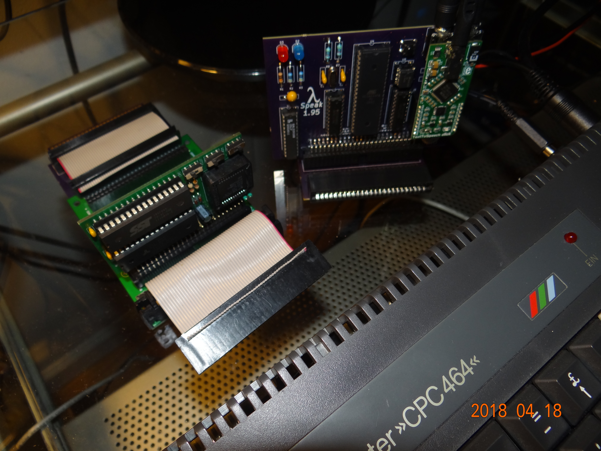

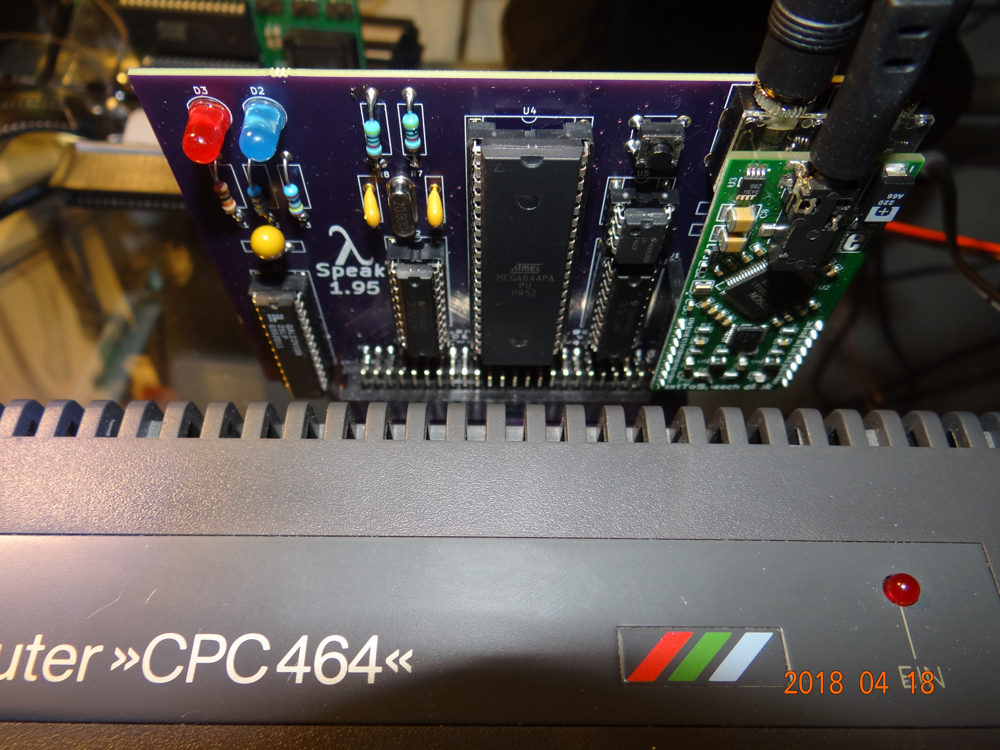

Below are a couple of YouTube videos that demonstrate the various features and modes of LambdaSpeak. Notice that these videos are showing older versions of the LambdaSpeak hardware, but there is no difference in functionality. Also, speech quality etc. is identical to the current version of LambdaSpeak:  

- [LambdaSpeak Native Mode - talking ELIZA Program](https://youtu.be/ckCTHi5_2f8)
- [LambdaSpeak DK'tronics & SSA-1 Emulation - German-speaking ELIZA program, originally written for the DK'tronics speech synthesizer](https://youtu.be/aTxufTKfrYk) 
- [LambdaSpeak and DK'tronic Speech ROM Software](https://youtu.be/wxNSlEyfPMc)
- [TFM's LambdaSpeak |RSX Driver](https://youtu.be/CsaE9JfhJ20)
- [Sample Playing in "Amdrum mode" with TFM's |RSX Driver](https://youtu.be/RSu7fPpDmCQ)
- [PCM Audio Quality of Amdrum Mode using Amdrum Software](https://youtu.be/pBuBxT3YEuI)
- [Amdrum Demo](https://youtu.be/upVayBKlnow)
- [Another Amdrum Demo](https://youtu.be/E63uH6SpzMs)
- [LambdaSpeak 2.1 Breadboard Prototype with additional SPO256-AL2](https://youtu.be/Og3qyQo9nfw)

The historical **LambdaSpeak Ancestry Gallery** shows early versions of LambdaSpeak. Some early versions were using the **Emic 2** TTS daughterboad instead of the "TextToSpeech click" from Elektronika: 

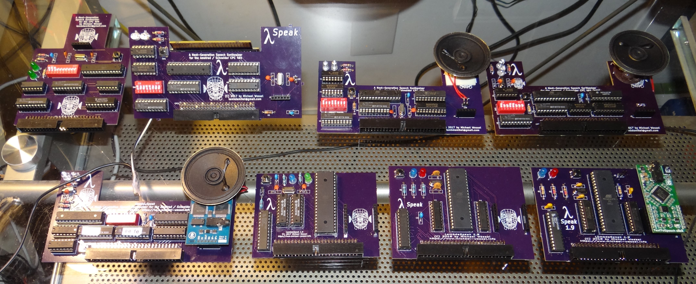

### Hardware Overview 

These are the main components of LambdaSpeak 1.95: 

1. Epson S1V30120 Text-to-Speech Speech Synthesizer IC. The [39$ "TextToSpeech click" board from MikroElektronika](https://www.mikroe.com/text-to-speech-click) is used as a daughter board. It is plug and play, but requires re-soldering of an SMD jumper (from 3.3 V to 5 V position).   
2. ATmega 644P-20PU Microcontroller clocked at 20 MHz (U4). 
3. GAL22V10 Programmable Logic Device (U1), for Z80 address decoding and some glue logic. This is a discontinued component, but still easy to get on EBay. 
4. Some more glue logic: a 74LS244 bus driver (U3) and a 74LS374 flip flop (U2).
5. Optional: a LM741CN op-amp (U5) for mixing PCM output (produced by the ATmega 644) with the speech output from the Epson S1V30120 such that only one audio cable from LambdaSpeak is required. 

Here are the [schematics of LambdaSpeak 1.95.](schematics/lambdaspeak-195-schematics.pdf). 

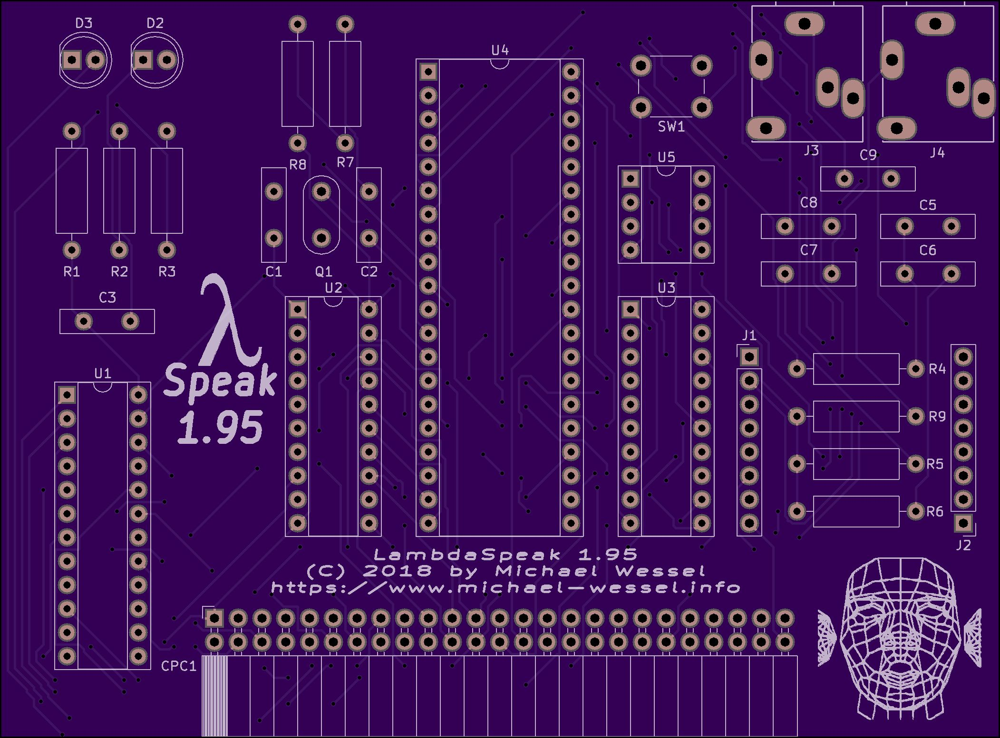

In addition to [the schematics of LambdaSpeak 1.95](schematics/lambdaspeak-195-schematics.pdf), have a look at the [pin assignments for the GAL22V10](firmware/ls195/gal22v10/ls195.PLD) and the [pin assignments for the ATmega](firmware/atmega644/ls195-pins.h). 

In a future version of LambdaSpeak, **LambdaSpeak 2.0**, the GAL22V10, 74LS244 and 74LS374 are going to be substituted by a single **Xilinx XC9572XL CPLD** (QFP-64 encapsulation), and an SMD version of the ATmega 644P-20PU will be used, reducing the chip count by 2. A working breadboard prototype of LambdaSpeak 2.0 exists, but no (SMD) PCB has yet been designed. **Bryce**, well-known in the CPC community for his MegaFlash board, is working on a PCB for LambdaSpeak 2.0. 

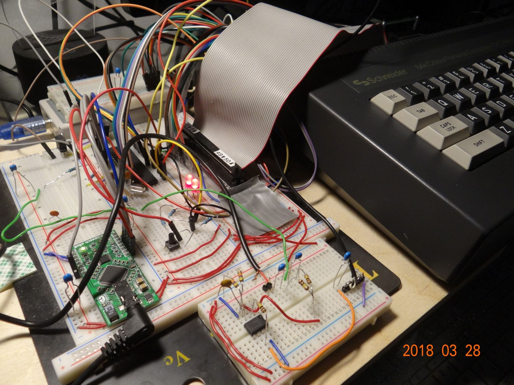

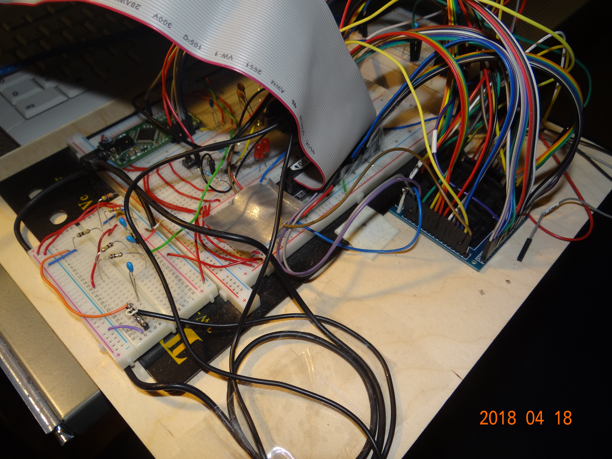

Take a look at the [pin allocations for the Xilinx CPLD](firmware/ls20/xilinxXC9572XL/Main.ucf) and the [pin assignments for the ATmega](firmware/atmega644/ls195-pins.h); the latter one is identical with LambdaSpeak 1.95. Also, the [ATmega 644 firmware](firmware/atmega644/lambdaspeak15181920combined.hex) is the same for LambdaSpeak 1.95; hence, the only difference between LambdaSpeak 1.95 and LambdaSpeak 2.0 is the firmware for the GAL / CPLD.   

LambdaSpeak 2.1 is equipped with additional SPO256-AL2 for authentic retro speech synthesis. 

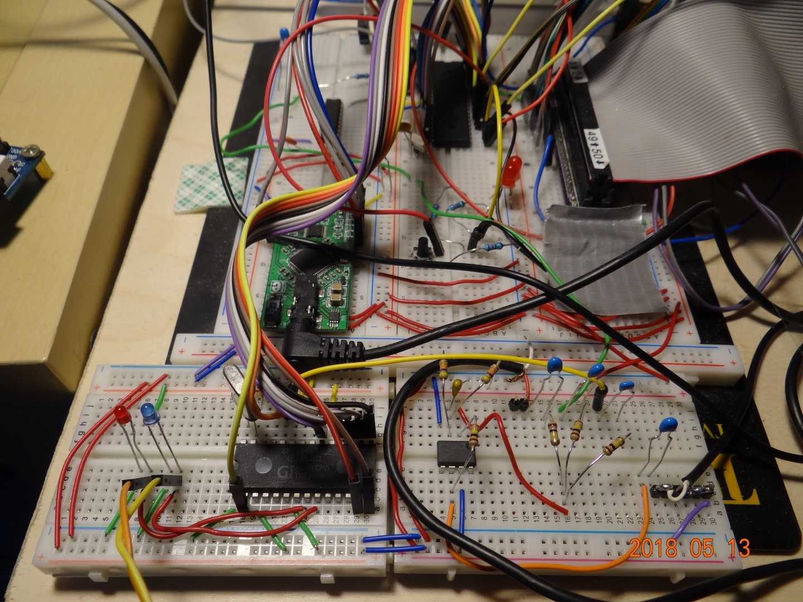

### The LambdaSpeak 1.95 Printed Circuit Board (PCB)  

The [Gerbers can be found here](gerbers/). They are also [shared on OshPark for immediate ordering](https://oshpark.com/shared_projects/C2toYu43) - this will give you 3 LambdaSpeak 1.95 PCBs for about 60 $, you still need to assemble / solder it then, buy a  ["TextToSpeech click" board from MikroElektronika for 39 $](https://www.mikroe.com/text-to-speech-click), and change its SMD jumper to the 5 V position. Next, you will have to program ("flash") the GAL22V10 and ATmega644 with the supplied "firmware" hex files from this repository. This requires ATmega and Eprom programmers. 

For 50 $, I can send you a programmed GAL22V10 and a ATmega 644P-20PU. For 100 $, I can assemble a complete LambdaSpeak 1.95 for you. Please contact me via email if you are interested.  
 

#### Bill of Material & Footprints (KiCAD) 

These are the components you will need for LambdaSpeak 1.95: 

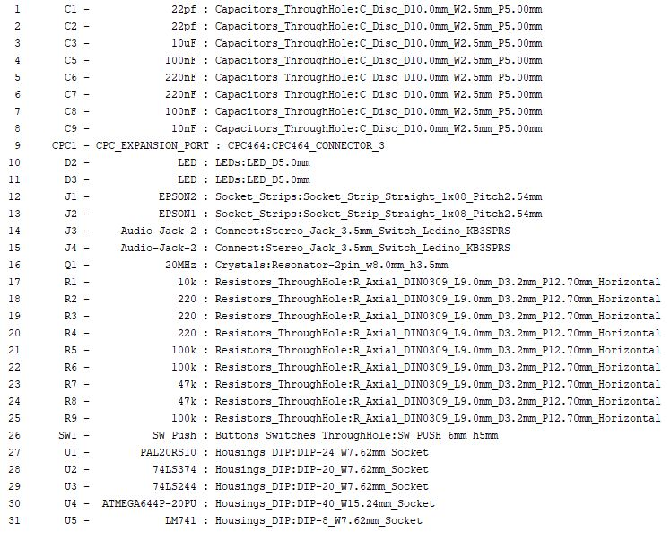

In addition, I suggest to use standard stackable Arduino Headers for J1, and J2, for plugging in the speech daughter board (instead of soldering it in permanently). A standard 2x25 angled IDC Box Header can then be used to plug LambdaSpeak into the **Mother X4 board**, to connect a 50 pin ribbon cable, or to plug it into [my CPC 464 epansion port connector](https://oshpark.com/shared_projects/3yA33GYO).

The form factors in the above BOM are for illustration only. Instead of ceramic disc capacitors, I have used ceramic multilayer capacitors mostly. I recommend using DIP sockets at least for the GAL22V10 and for the ATmega 644, such that they can be reprogrammed / reflashed easily when a new firmware arrives.

The audio section is completely optional. If you don't require audio mixing, just route the "Amdrum" PCM output directly to audio output jack J4, and you wont need J3 at all. This can be achieved by connecting a cable between C6 and C8 (check the schematics), and by omitting all of the audio circuitry. You will still need the RC for Amdrum mode though, i.e., C5 and R4 are still required. In this configuration without audio circuitry, the resistors R7, R8, R9, the J4 audio jack, and capacitors C6, C7, C8, C9, and the op-amp U5 can be omitted. Speech output then comes directly from the daughter board's audio jack. It is also convenient to at least keep audio jack J4 for Amdrum PCM output, as described. 

By default, the left channel of the stereo output audio jack is being used. To route the signal to both channels, apply the following modification and bridge the 2 audio jack pins with a cable as shown in the following picture: 

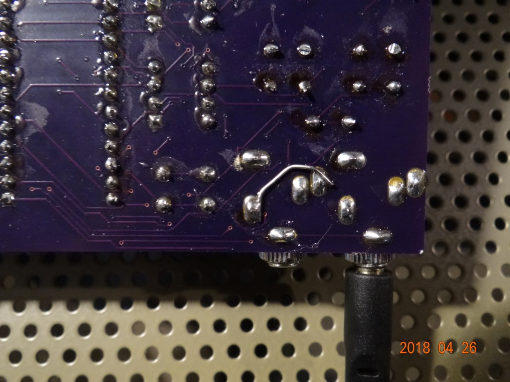

### Firmware for LambdaSpeak 1.95 - GAL22V10 and ATmega 644 

The GAL22V10 firmware was designed using WinCUPL. You only need the supplied [GAL22V10 JED file](firmware/ls195/gal22v10/ls195.jed) and program / flash it using an Epromer. I have successfully used the [Genius G540 USB Universal Programmer](https://www.amazon.com/gp/product/B075TGDDJM) for programming the GAL22V10 (B and D), and with much less success I have also used the [Signstek TL866CS Universal USB MiniPro EEPROM FLASH BIOS Programmer](https://www.amazon.com/gp/product/B00K73TSLM) (this one fails on most of my GAL22V10Bs, though, but works fine on most of the GAL22B10Ds). 

For ATmega programming, I am using USBTinyISP, and a standard [ATmega programming board](https://www.ebay.com/itm/AVR-ATMEGA16-Minimum-System-Board-ATmega32-USB-ISP-USBasp-Programmer-F-ATMEL-S/352106489534). Here is [the ATmega 644 LambdaSpeak firmware HEX file](firmware/atmega644/lambdaspeak15181920combined.hex) - I have programmed the ATmega [using avrdude with these settings](firmware/atmega644/avr-flash.txt) (notice the fuses). 

### Firmware for LambdaSpeak 2.0 - Xilinx XC9572XL and ATmega 644  

The Xilinx CPLD firmware was designed using Xilinx' ISE WebPACK design software, in Verilog. The CPLD was programmed using a QFP-64 test socket, connected via JTAG pins to the standard  Xilinx USB plattform cable. Here is [the JED file for the Xilinx CPLD](firmware/ls20/xilinxXC9572XL/Main.jed). 

[ATmega 644 firmware](firmware/atmega644/lambdaspeak15181920combined.hex) and [programming instructions (using USBTiny and avrdude)](firmware/atmega644/avr-flash.txt) are identical to LambdaSpeak 1.95, see above. 

### Detailed Description of the ATmega LambdaSpeak Firmware (Version 4) 

The **current version** of the unified LambdaSpeak ATmega firmare is **4**. The highest firmware version will be 15. The unified ATmega LambdaSpeak firmware supports LambdaSpeak 1.5, LambdaSpeak 1.8, LambdaSpeak 1.95, and LambdaSpeak 2.0.  

LambdaSpeak 1.95 listens to the CPC's IO ports &FBEE and &FAEE (in SSA-1 mode),  to &FBFE (in DK'tronics modes), as well as to &FFxx in Amdrum mode (and only then). The native DECtalk and native Epson modes are also using IO port &FBEE. 
 
The LambdaSpeak 1.95 hardware uses a single signal for address decoding from the GAL22V10 to the ATmega 644, so in fact, the LambdaSpeak firmware cannot distinguish whether a request was made for &FBEE, &FAEE, &FBFE, or &FFxx. However, &FFxx is only decoded in Amdrum mode (a signal is given to the GAL from the ATmega in order to en/disable &FFxx decoding). For the other modes, the current mode of LambdaSpeak determines how LambdaSpeak reacts to the IO request at &FBEE, &FAEE, or &FBFE, respectively. Even though these addresses are decoded "in parallel", the LambdaSpeak RSX Driver by TFM, the SSA-1 driver software, and the DK'tronics driver software are not getting confused, because their protocols are different (in fact, all these driver softwares can be used in parallel). 

ASCII for speech is only 7 Bit. Hence, every byte with the 8th bit being set is considered a **control byte** and used for controlling LambdaSpeak, for setting the current mode, changing the current voice,  volume and speech rate, etc.  

Many of these modes are demonstrated in the BASIC program `demo01.bas` found on the [`LS195.dsk` disk](cpc/lambda/LS195.dsk). 

Currently, LambdaSpeak 1.95 resp. Firmware Version 4 supports the following Control Bytes: 

- &FF: reset LambdaSpeak. Only works if LambdaSpeak is not in PCM test mode, or in Amdrum mode. Even the reset button of LambdaSpeak will be ineffective during PCM sample playing (interrupts are disabled during PCM sample playing in order to maximize audio sample quality).  Reset puts LambdaSpeak into default configuration.  The **default mode** is the **SSA-1 emulation mode**. 

The **first group of control bytes** determines the **mode** of LambdaSpeak: 

- &EF: native LambdaSpeak / Epson mode. This is the simplest mode. In this mode, simply send a series of ASCII characters to IO port &FBFE, terminated by CR (13), to make it speak the string. In Epson mode, LambdaSpeak uses the **value 32 on port &FBFE to signal that it is ready to accept the next byte.** Voice, pitch, volume, and speech rate (words per minute) can be changed, see below. By default, a so-called **blocking mode** of operation is used for the native Epson mode. In **blocking mode**, the Z80 CPU / the CPC is **halted** while LambdaSpeak is speaking. This is achieved by pulling down the Z80 READY signal available on the expansion port. Control returns to the CPC when the speech has finished. However, in order to cancel / interrupt the speech, LambdaSpeak also offers a **non-blocking mode** of operation, in which the Z80 is not halted while LambdaSpeak is speaking. Hence, while LambdaSpeak is speaking, a **stop** control byte can be sent to LambdaSpeak from the CPC, and LambdaSpeak will stop speaking immediatly. Notice that sending the **stop** control byte (byte &DF) is **the only operation that is supported in non-blocking mode while LambdaSpeak is speaking**. Being able to abort the currently ongoing speech is the sole purpose of the non-blocking mode. 

- &EE: native DECTalk mode of LambdaSpeak. This mode is more involved than the Epson mode, as the DECTalk syntax allows phoneme-based control of speech synthesis. Check out the DECTalk manual and have a look at `demo01.bas`. In DECTalk mode, LambdaSpeak uses the **value 32 on port &FBEE to signal that it is ready to accept the next byte.** Check out the DECTalk manual to learn about the more involved and powerful DECTalk syntax. As for the Epson mode, DECTalk mode supports a blocking and a non-blocking mode of operation, see above for explanation. 

- &ED: Amstrad SSA-1 emulation mode. A 90% compatible emulatation of the SSA-1 speech synthesizer; check out games like "Roland in Space" or the SSA-1 driver software supplied in this repository. The ports are **&FBEE and &FAEE**, and the ready signal(s) of the SSA-1 are emulated accordingly. The emulation is faithful enough for games and the SSA-1 driver software to work well. It was tested with the SSA-1 driver software, and the games "Tubaruba", "Alex Higgins' World Pool", "Roland in Space", and a couple more, and worked flawlessly. Since the timing is not 100% accurate / faithful to the original hardware, I do not guarantee 100% compatibility. Check out the YouTube videos above to get an idea about SSA-1 emulation and compatibility. 
  - Please note that the SSA-1 mode **always works asynchronously** and that the CPC / Z80 CPU will never be paused. Rather, phonemes are being  buffered, and when the buffer is full (it has a capacity of 380 bytes), or when no phoneme has arrived for a couple of milliseconds (the flush delay time is configurable, see below), the buffer is flushed and spoken. Hence, **blocking and non-blocking mode** does not apply to the SSA-1 mode. 

- &EC: DK'tronics speech synthesizer emulation mode. A 90% emulation of the DK'tronics speech synthesizer. Same comments as for the SSA-1 emulation apply. DK'tronics uses the port **&FBFE**, and the ready signal is a bit simpler than in the SSA-1 case (only one bit is used); the signal is emulated accordingly. The speech synthesizer was tested with the DK'tronics ROM software, the DK'tronics speech synthesizer cassette software, and some old BASIC programs that were written for the DK'tronics (e.g., see `elisa.bas` on the `LS195.dsk`). Some games were tested as well, including "Jump Jet", "Alex Higgins' Pool", etc. Check out the YouTube videos to get an idea about DK'tronics emulation and compatibility. 
  - The same comments regarding phoneme buffer and blocking and non-blocking mode as for the SSA-1 mode apply to the DK'tronics mode. Same thing. 

- &EB: enable non-blocking mode for native Epson and native DECTalk mode of LambdaSpeak. Explained above, see there. Does not apply to SSA-1 and DK'tronics mode. 

- &EA: enable blocking mode for native Epson and native DECTalk mode. See explanation above. Does not apply to SSA-1 and DK'tronics mode. 

- &E9: by default, LambdaSpeak confirms all control bytes and changes to configuration by voice. This enable these audible voice confirmations. 

- &E8: puts LambdaSpaak into a less verbose / silent mode, where it does not confirm changes to configuration and modes. Of course, it will still speak in this mode, but no longer confirms control bytes audibly by voice. 

- &E7: the DECTalk / Epson firmware supports Spanish and English text-to-speech synthesis. This enables the English mode. This is the default for LambdaSpeak. Does not apply to DK'tronics or SSA-1 mode; for these, no text-to-speech conversion takes place, as this is handled in the SSA-1 or DK'tronics driver software. The driver software performs a text-to-phoneme translation, and phonemes are being sent to LambdaSpeak. These get mapped to DECTalk phonemes then. 

- &E6: Spanish language mode. Not really tested, but should work. 

- &E5: enables the **fast getters mode**. The firmware offers a couple of "getter" methods / control bytes which can be used to query / acquire the current settings of LambdaSpeak, e.g., the current volume, current voice, etc. These "getter" methods / control bytes follow a certain "data transmission" protocol. If a getter is invoked, LambdaSpeak first puts a zero-byte on the Z80 / CPC data bus (note that all LambdaSpeak modes use a non-zero "ready" signal on the data bus, so ready cannot be confused with zero), then it waits for 50 microseconds, next puts the requested data 4bit value (e.g., the current volume) on the data bus for 50 microseconds, and then puts another zero-byte on the databus for 50 microseconds, before returning to normal LambdaSpeak operation (i.e., the **ready signal** of the corresponding mode is given on the databus). Notice that the zero-byte is reserved for this synchronization purpose, and the "getter" methods / control bytes will never return a zero value (i.e., there is no zero volume, no voice number zero, etc.) Hence, a program reading these values can check for these "zero-padded 4bit values". Using &E5, the described time delays are short, i.e., 50 microseconds, suitable for machine code programs that want to read the LambdaSpeak settings. 

- &E4: using the **slow getters mode**, the requested setting value is much longer visible on the databus, i.e., for 50 milliseconds (compared to the 50 microseconds in **fast getters mode**). This mode is suitable for (slower) BASIC programs that want to read the LambdaSpeak settings.   

- &E3: LambdaSpeak offers a PCM sample-playing mode - it emulates the **Amdrum module**. In this mode, every byte sent to port &FFxx (xx = arbitrary) will immediatly be played as an 8bit PCM sample. The **Amdrum software** works out of the box in this mode, and sample quality is surprisingly good / high, given that no DAC chip is used, but the PCM conversion is implemented in software on the ATmega 644, using a fast timer. This mode can only be exited by power cycling LambdaSpeak. All ATmega interrupts are disabled, for maximimum processing speed and sample quality. Hence, even the reset button of LambdaSpeak is ineffective. Decoding of IO addresses &FFxx will only be active when the Amdrum mode is enabled (the ATmega enables a control signal / line to the GAL22V10 address decoder or Xilinx CPLD, respectively). 

- &DF: in non-blocking native Epson (or native DECTalk) mode, **speech can be stopped immediatly by sending this control byte**. This is the only control byte which can be processed in non-blocking mode while LambdaSpeak is speaking. The sole purpose of the non-blocking mode is to allow the sending of this stop byte and such that speech can be stopped / interrupted at any time in this mode. 

- &DE: in SSA-1 or DK'tronics mode, a phoneme buffer is used. The buffer is flushed when no new phoneme has arrived for a certain amount of time, or when the buffer is full. The buffer can also be flushed at any time by sending this control byte. 

The **next group of control bytes** is used for getting info, and reading settings (so-called "getter" methods / "getter control bytes"). The getter methods return 4bit values, and the upper 4bits of the databus are being used (upper nibble, bits 4, 5, 6, and 7). There is never a zero value being returned. The zero-byte is used for synchronization instead, as "padding byte", as explained above.  Notice that the returned value will be available on the databus for either 50 microseconds (in "fast getters" mode), or for 50 milliseconds (in "slow getters" mode). Before and after, a zero-byte is sent. 

- &CF: returns the current mode. This is a 4bit vector, using the upper 4 bits. Bits 4 and 5 indicate the current mode (native Epson, native DECTalk, SSA-1, DKtronics, from 0 to 3), bit 6 is on if blocking mode is enable, and off otherwise; and bit 7 is off for English mode, and on for Spanish mode.

- &CE: returns the current volume. 

- &CD: returns the current voice. The voices 1 to 8 are pre-defined. 

- &CC: returns the current speak rate. 

- &CB: returns the current language. 

- &CA: returns the current flush buffer delay time, in milliseconds.  

- &C9: returns the current firmware version number (currently, 4). 

- &C8: speaks a copyright note.

- &C7: get a quote from HAL 9000! 

- &C6: sing "Daisy Bell", a classic DECTalk song. 

- &C5: an echo test program to check IO port communication. In this mode, every byte sent to port &FBEE and &FAEE is immediately "echoed" back onto the databus, such that it can be read and compared with the byte that was sent. The sent and returned byte should be identical, of course. This mode can only be exited by pushing the LambdaSpeak reset button, or by power cycling of course. 

- &C4: like &C5, but for port &FBFE. 

- &C3: speak a test message. Useful for testing different voices and speech parameters (speech rate, etc.)

- &C2: PCM sample test. Play a sample from HAL 9000 - "I'm completely operational", using the Amdrum PCM output. Use LambdaSpeak's reset button to exit this mode.  

- &B0: set current voice to the default voice. 

- &B1 - &BF: set current voice to voice 1 (&B1) to 15 (&BF). 

- &A0: set current volume to the default volume. 

- &A1 - &AF: set currrent volume to volume level 1 (&A1) to volume level 15 (&AF). 

- &90: set current speak rate to default speak rate. 

- &91 - &9F: set current speak rate to rate level 1 (&91) to rate level 15 (&9F). 

- &80: set flush buffer delay time to default time. 

- &81 - &8F: set current flush buffer delay time to delay time 1 (&81) to delay time 15 (&8F). 

Overview of all control bytes, as discussed:      
     
      case 0xFF : process_reset(); break; 
    
      case 0xEF : native_mode_epson(); break; 
      case 0xEE : native_mode_dectalk(); break; 
      case 0xED : ssa1_mode(); break; 
      case 0xEC : dktronics_mode(); break; 
      case 0xEB : non_blocking(); break; 
      case 0xEA : blocking(); break; 
      case 0xE9 : confirmations_on(); break;  
      case 0xE8 : confirmations_off(); break;   
      case 0xE7 : english(); break; 
      case 0xE6 : spanish(); break; 
      case 0xE5 : fast_getters(); break; 
      case 0xE4 : slow_getters(); break; 
      case 0xE3 : amdrum_mode(); break; 
    
      case 0xDF : stop_command(); break;  
      case 0xDE : flush_command(); break;
     
      case 0xCF : get_mode(); break; 
      case 0xCE : get_volume(); break; 
      case 0xCD : get_voice(); break; 
      case 0xCC : get_rate(); break; 
      case 0xCB : get_language(); break; 
      case 0xCA : get_delay(); break; 
      case 0xC9 : get_version(); break; 
      case 0xC8 : speak_copyright_note(); break; 
      case 0xC7 : speak_hal9000_quote(); break; 
      case 0xC6 : sing_daisy(); break; 
      case 0xC5 : echo_test_program(); break; 
      case 0xC4 : echo_test_program_dk(); break; 
      case 0xC3 : test_message(); break; 
      case 0xC2 : pcm_test(); break; 
    
      case 0xB0 : set_voice_default(); break;
      case 0xB1 : set_voice(1); break; // default
      case 0xB2 : set_voice(2); break;
      case 0xB3 : set_voice(3); break;
      case 0xB4 : set_voice(4); break;
      case 0xB5 : set_voice(5); break;
      case 0xB6 : set_voice(6); break;
      case 0xB7 : set_voice(7); break;
      case 0xB8 : set_voice(8); break;
      case 0xB9 : set_voice(9); break;
      case 0xBA : set_voice(10); break;
      case 0xBB : set_voice(11); break;
      case 0xBC : set_voice(12); break;
      case 0xBD : set_voice(13); break;
      case 0xBE : set_voice(14); break;
      case 0xBF : set_voice(15); break;
    
      case 0xA0 : set_volume_default(); break;
      case 0xA1 : set_volume(1); break;
      case 0xA2 : set_volume(2); break;
      case 0xA3 : set_volume(3); break;
      case 0xA4 : set_volume(4); break;
      case 0xA5 : set_volume(5); break;
      case 0xA6 : set_volume(6); break;
      case 0xA7 : set_volume(7); break;
      case 0xA8 : set_volume(8); break;
      case 0xA9 : set_volume(9); break;
      case 0xAA : set_volume(10); break;
      case 0xAB : set_volume(11); break;
      case 0xAC : set_volume(12); break;
      case 0xAD : set_volume(13); break;
      case 0xAE : set_volume(14); break; // default 
      case 0xAF : set_volume(15); break;
    
      case 0x90 : set_rate_default(); break;
      case 0x91 : set_rate(1); break;
      case 0x92 : set_rate(2); break;
      case 0x93 : set_rate(3); break;
      case 0x94 : set_rate(4); break;
      case 0x95 : set_rate(5); break;
      case 0x96 : set_rate(6); break;
      case 0x97 : set_rate(7); break;
      case 0x98 : set_rate(8); break;
      case 0x99 : set_rate(9); break;
      case 0x9A : set_rate(10); break;
      case 0x9B : set_rate(11); break;
      case 0x9C : set_rate(12); break; // default
      case 0x9D : set_rate(13); break;
      case 0x9E : set_rate(14); break;
      case 0x9F : set_rate(15); break;
    
      case 0x80 : set_buffer_delay_default(); break;
      case 0x81 : set_buffer_delay(1); break;
      case 0x82 : set_buffer_delay(2); break;
      case 0x83 : set_buffer_delay(3); break;
      case 0x84 : set_buffer_delay(4); break;
      case 0x85 : set_buffer_delay(5); break;
      case 0x86 : set_buffer_delay(6); break;
      case 0x87 : set_buffer_delay(7); break;
      case 0x88 : set_buffer_delay(8); break;
      case 0x89 : set_buffer_delay(9); break;
      case 0x8A : set_buffer_delay(10); break; // default !!
      case 0x8B : set_buffer_delay(11); break;
      case 0x8C : set_buffer_delay(12); break;
      case 0x8D : set_buffer_delay(13); break;
      case 0x8E : set_buffer_delay(14); break;
      case 0x8F : set_buffer_delay(15); break;    
     

### CPC Software and Firmware Communication Example 

Here is the `demo01.bas` BASIC program (can also be found on the [`LS195.dsk` disk](cpc/lambda/LS195.dsk)) that illustrates LambdaSpeak use and programming, how to use native Epson and native DECTalk mode. The latter uses a fragement of the DECTalk "Happy Birthday" song found online. The program also shows how to change the current voice, how to use the "getter" commands to retrieve / read the current LambdaSpeak settings for voice and volume etc., and how to interrupt / abort ongoing speech whilst in non-blocking mode. 
    
    10 OUT &FBEE,&FF
    20 a=INP(&FBEE):IF a<>128 GOTO 20
    30 PRINT "hit space bar for quiet"
    40 OUT &FBEE,&EF
    50 WAIT &FBEE,32
    60 OUT &FBEE,&EB
    70 WAIT &FBEE,32
    80 a$="hello how are you i am lambdaspeak 123456789"
    90 FOR i=1 TO LEN(a$)
    100 c$=MID$(a$,i,1) 
    110 OUT &FBEE,ASC(c$)
    120 NEXT
    130 OUT &FBEE,13
    140 a=INP(&FBEE)
    150 IF INKEY$=" " THEN OUT &FBEE,&DF:PRINT "quiet!"
    160 IF a<>32 GOTO 140
    170 REM
    180 OUT &FBEE,&EE
    190 a$="[:phone arpa speak on][:rate 200][:n1][hxae<300,10>piy<300,10> brr<600,22>th<100>dey<600,19>dih<600,15>rdeh<600,14>ktao<600,12>k_<120>_<120>][:n1]"
    200 a$=a$+"[:phone arpa speak on][:rate 200][:n3][hxae<300,10>piy<300,10> brr<600,22>th<100>dey_<120>_<120>][:n3]"
    210 FOR i=1 TO LEN(a$)
    220 c$=MID$(a$,i,1)
    230 OUT &FBEE,ASC(c$)
    240 NEXT
    250 OUT &FBEE,13
    260 a=INP(&FBEE)
    270 IF INKEY$=" " THEN OUT &FBEE,&DF:PRINT "quiet!"
    280 IF a<>32 GOTO 260
    290 REM
    300 OUT &FBEE,&CE
    310 WAIT &FBEE,255
    320 PRINT INP(&FBEE)/16
    330 a=INP(&FBEE):IF a<>0 THEN GOTO 330
    340 WAIT &FBEE,32
    350 OUT &FBEE,&CC
    360 WAIT &FBEE,255
    370 PRINT INP(&FBEE)/16
    380 a=INP(&FBEE):IF a<>0 THEN GOTO 380
    390 WAIT &FBEE,32
    400 OUT &FBEE,&B2
    410 WAIT &FBEE,32
    420 OUT &FBEE,&CD
    430 WAIT &FBEE,255
    440 PRINT INP(&FBEE)/16
    450 a=INP(&FBEE):IF a<>0 THEN GOTO 450
    460 WAIT &FBEE,32
    470 OUT &FBEE,&CD
    
#### LambdaSpeak |RSX Driver and ROM by Dr. Stefan Stumpferl (aka TFM, Gunhed)

[TFM](http://futureos.cpc-live.com/pics/tfm_gr.jpg), well-known in the CPC Community for his [FutureOS operating system for the CPC](http://futureos.cpc-live.com/), has created an awesome |RSX driver for LambdaSpeak. It comes in two versions - as a ROM, and as a disc-based relocatable driver (loadable from BASIC). |RSX commands exists for all LambdaSpeak control bytes, and also some high-level functions are offered that do not directly correspond to LambdaSpeak control bytes. For example, a PCM sample `|play` command (and `|eplay` for playing from an extended memory extension) for LambdaSpeak's Amdrum mode is offered, as well as a `|speakscreen` screen reading and a `|speakfile` file reading function. 

The disc version of the software is shown in the following picture:  

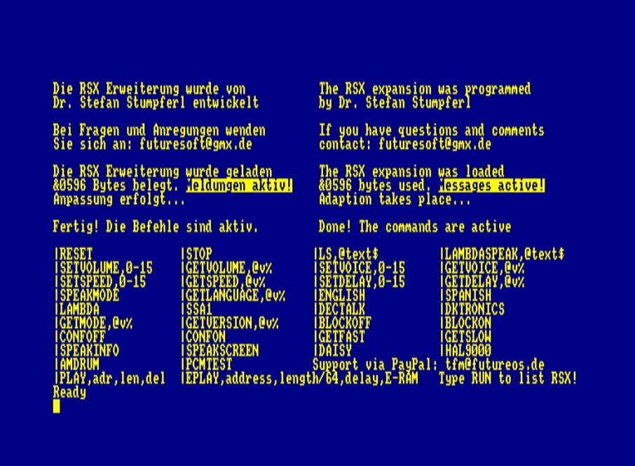

Here is a picture of the LambdaSpeak ROM, `|lshelp` command: 

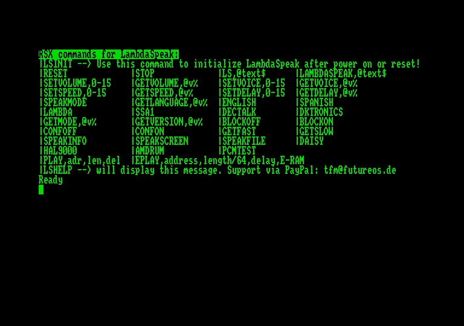

The latest version of the [LambdaSpeak driver software is hosted on TFM's home page](http://futureos.cpc-live.com/files/LambdaSpeak_RSX_by_TFM.zip). The zip file also contains a `README` and the `.dsk` file contains an extensive manual describing all features of the software. 

### Acknowledgements

Bryce, for taking on the job of designed the LambdaSpeak 2.0 PCB SMD, and for guiding and pushing me into the right direction - Xilinx CPLD instead of GAL22V10, Verilog instead of WinCupl, etc. Stay tuned for updates from Bryce regarding the LambdaSpeak 2.0 reimplementation with SMD components and reduced chip count due to the Xilinx CPLD. 

Special thanks go to "zhulien" from the CPC Wiki Forum for suggesting to implement the Amdrum mode! Without him, this mode would not exist (I didn't even know about the Amdrum module) 

#### Disclaimer 

Use at your own risk. I am not responsible for any potential damage you might cause to your CPC, other machinery, or yourself, in the process of assembling and using this piece of hardware.

Enjoy! 

